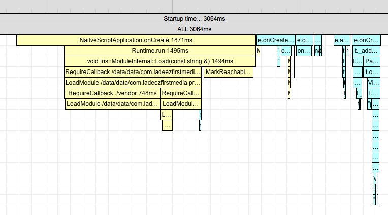
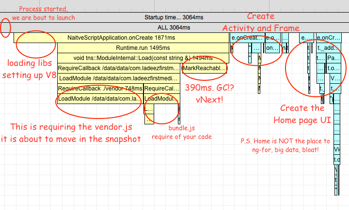
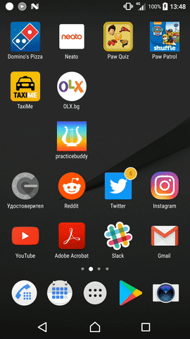
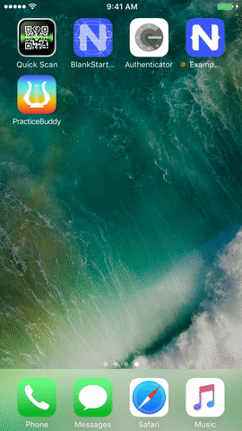

# NativeScript 3.1.0: Performance Improvements and Timeline Introduction
Performance has been a high priority feature in {N} all along its development. During the course of development we found ourselves manually instrumenting all of the Objective-C, Java, C, C++ and the JavaScript code several times, but so far these profile traces were kept for internal use only and never made it to the "master".

With 3.1.0 we have "merged" the manual instrumentation and enabled all {N} apps to trace execution times of some key components. Here is how to consume this.

## Enable Traces
In the `app/package.json` set `profiling` to `timeline`:
```json
{
    "main": "MyApp",
    "profiling": "timeline"
}
```
This will enable the traces and will output times in the console directly.

The feature is in experimental state and we are tunning it with the @next releases, so if you want to use it consider installing the next versions of the `tns-core-modules` and the run-times.
```bash
tns platform add android@next
npm i tns-core-modules@next
```

Running the app now will be pretty verbose.

```bash
CONSOLE LOG Timeline: Runtime: Expose: UIViewController  (98155132.912ms - 98155218.291ms)
CONSOLE LOG Timeline: Runtime: Expose: UIView  (98155124.914ms - 98155221.567ms)
CONSOLE LOG Timeline: Runtime: Expose: UIResponder  (98155124.841ms - 98155234.224ms)
CONSOLE LOG Timeline: Runtime: Expose: UIScreen  (98155124.591ms - 98155238.539ms)
CONSOLE LOG Timeline: Runtime: require: /app/tns_modules/tns-core-modules/utils/utils.js  (98155114.122ms - 98155239.010ms)
CONSOLE LOG Timeline: Runtime: require: /app/tns_modules/tns-core-modules/image-source/image-source.js  (98155239.113ms - 98155260.134ms)
CONSOLE LOG Timeline: Runtime: require: /app/tns_modules/tns-core-modules/ui/styling/background.js  (98155097.347ms - 98155268.315ms)
CONSOLE LOG Timeline: Runtime: require: /app/tns_modules/tns-core-modules/ui/core/properties/properties.js  (98155295.330ms - 98155313.461ms)
```

The traces times are the start and end time of the event in milliseconds since 1970.

You now get an overview of the processes that take place during your app's execution, and how long they take.

## Tooling
In their raw state, the logs are barely readable to the naked eye. There is a small tool that can collect the traces and visualize them in an HTML flame chart. To install the tool:
```bash
npm i -g timeline-view
```
Then run the app and pipe the output through the tool:
```bash
tns run android | timeline-view
tns run ios | timeline-view
```
Run the app and after launch click `Ctrl + C` in the terminal to break the CLI execution, the `timeline-view` will collect the traces before exit and generate the report. It will print the location of the report in the terminal so you can open it easily in a browser.

Here is how the report looks:


## Practice Buddy
Practice Buddy is a NativeScript + Angular app that enables people train music remotely, it connects trainers and trainees.

Kudos to Jen Looper. The app makes a great example of the timeline and performance improvements for 3.1.0. Here are some times.

### Android
#### Timeline: tns run android
Enabling the tracing by updating its `app/package.json` and running the app with `tns run android | timeline-view`:

[Android vanilla run HTML times report](./timelines/tns-run-android.html).

The app does:
 - 2100ms. extracting assets
 - 2200ms. initializing the runtime
 - 1350ms. requiring vendor modules - tns-code-modules, angular etc.
 - 750ms. MarkReachableObjects (GC)
 - ~2000ms. making NativeScript views

Total of about 9sec.

#### Timeline: npm run start-android-bundle --uglify
The vanilla `tns run` doesn't incorporate the webpack and the Angular tooling. Running the practice buddy app with webpack using:
```bash
npm run start-android-bundle --uglify | timeline-view
```

[Android bundle and uglify HTML times report](./timelines/npm-run-android-bundle.html).

The times are about:
 - 180ms. extracting assets
 - 180ms. initializing the runtime
 - 750ms. executing the vendor.js
 - 320ms. executing the bundle.js
 - 390ms. MarkReachableObjects (GC)
 - ~1000mx. making NativeScript views

Total of about 3sec.

#### Timeline: npm run start-android-bundle --uglify --snapshot
Adding the shiny new local V8 snapshot android feature:
```bash
npm run start-android-bundle --uglify --snapshot | timeline-view
```

[Android bundle, uglify and snapshot HTML times report](./timelines/npm-run-android-bundle-snapshot.html).

The times shrink further:
 - 230ms. extracting assets
 - 100ms. runtime initialization
 - 280ms. running starter js
 - ~1100ms. making NativeScript view.
 - 480ms. MarkReachableObjects (GC)

Total of about 2.5sec.

#### Extracting Assets?
But why do we need assets extraction (read JavaScript files, XML files, CSS files) when webpack can pack them all and they can get in the snapshot? These are extracted once on the very first launch. Subsequent launches won't include that time. So this is something we may consider handling better in distant future but at the moment is a task with low priority.

#### MarkReachableObjects?
This is the bad guy we have up our road-map to deal with in the near future. Basically when you create a function and enclose some objects in JavaScript and pass this as implementation for a Java interface, the NativeScript framework have to keep the Java objects alive while the function is alive in JavaScript. This happens upon GC, NativeScript will walk up the JavaScript function's object graph and root potential Java objects so they survive the Java garbage collection. This haven't been an issue in vanilla NativeScript applications nor the Android Runtime unit tests as the object graphs there are relatively small. Now with the snapshot we try to put all the JavaScript up front in the vendor.js and feed the heap as early as possible.

#### What was the V8 Snapshot Again?
There is an extensive blog of [what snapshots are and how to enable them by Ivan Buhov](https://www.nativescript.org/blog/improving-app-startup-time-on-android-with-webpack-v8-heap-snapshot).

What the snapshot does is to run a command line tool on your mac, execute all the JavaScript from your `vendor.js` in a V8 instance. Then capture the in memory objects into a big (increases app size) blob. When the app starts, instead of parsing and executing the JavaScript, the app just loads into memory the blob and continues.

Every time the app starts on a device it feels like a gamer is resuming a saved game - the app doesn't have to replay the loading, parsing and execution of the JS.

#### So How to Maximize the Benefit of it?
 - First minimize the amount of JavaScript your app requires
 - Then move as much as possible to the `vendor.js` so it makes its way to the snapshot

Running the `timeline-view` shows slow require paths. You will be surprised the amount of unused JavaScript the regular app brings in. As example:
 - Alexziskind1's looptidoo that depends on faker, and faker requires 30+ small locale files, your app will rarely need more than one
 - nativescript-marketplace-demo that display source code page, it brings highlight.js, while the app displays XML and JS sources, highlight.js brings support for much more
 - Practice Buddy requires the root of Rx.js, while in general when working with Rx.js you can require just the used operators

To further optimize the startup time for the Android version of Practice Buddy the following have been added to the `vendor.ts`:
```javascript
require("rxjs");
require("nativescript-angular/animations");
```
This saves another 200ms. for a total of the startup.

#### Webpack Bundle Analyzer
Finding chunks that should be moved from the `bundle.js` to `vendor.js` is easily done using the `webpack-bundle-analyzer` and has been covered in the
'[Using Webpack to Bundle Your Code](https://docs.nativescript.org/best-practices/bundling-with-webpack#inspecting-bundles)' NativeScript article.

In general you should move everything from node_modules to the vendor. However some plugins that use native Android APIs will have to be refactored as the native APIs are not exposed during the snapshot generation. You can check the PR for the [nativescript-plugin-firebase made by Stanimira Vlaeva](https://github.com/EddyVerbruggen/nativescript-plugin-firebase/pull/424), it wraps the access to Android Java classes in functions and delay their execution until runtime. When it is merged, a `require("nativescript-plugin-firebase")` should also be added to the `vendor.ts`.

Now this is the transition from 3.0.0 to 3.1.0 and snapshot explained:


### iOS
#### Timeline: tns run ios
Running vanilla ios build:
```bash
tns run ios | timeline-view
```

[iOS vanilla run HTML times report](./timelines/tns-run-ios.html).

The app does:
 - 400ms. preparing for live-sync
 - 500ms. waiting for debugger
 - 900ms. require nativescript-angular/platform
 - 850ms. require app.module.js
    - 500ms. require rxjs/Rx.js (this time is already included as part of the app.module.js)
 - ~1000ms making views

A total of 3sec. (Don't do the math yet)

This however shows about 900ms are spent in the main method that are executed only in debug. The waiting for debug time is removed in release. Extracting from the bundle is also removed, as it is part of the live-sync logic, and live-sync is not available in release. So release build would rather take 3sec.

#### Timeline: npm run start-ios-bundle --uglify
Running the iOS application with webpack, the Angular tooling and uglify gets the maximum out of an iOS application.
```bash
npm run start-ios-bundle --uglify | timeline-view
```

[iOS bundle and uglify HTML times report](./timelines/npm-run-ios-bundle-uglify.html).

The app does:
 - 500ms. waiting for debugger
 - 400ms. in vendor.js
 - ~500ms. making views

That is a little under a sec.

It is pretty plain and boring compared to the previous and the android versions. Bundling packs all files in a single file reducing IO, and the uglification has much higher impact since JavaScriptCore on iOS does no JIT compilation. Subtracting the 500ms. debug. The bundle extraction happens again but it is fast, in the previous case it was slow because of the number of files.

## Sweet Awesomeness
With fast times comes great responsibility. Now that your app starts under a second on iOS and acceptable two seconds on Android, how do we make the best impression for the transition from the SpringBoard to your app's content? You can't put your app's slogan nor a fancy animation since there is simply not enough time for the user to consume it.

### Icons and Launch Screens
Icons must morph gently into launch screens and the launch screens must morph gently into your app's content. Keep that in mind when designing you assets.

For iOS the best example would be the launch of the calculator app. It follows brilliantly the Apple's:

[Human Interface Guidelines for Launch Screens](https://developer.apple.com/ios/human-interface-guidelines/graphics/launch-screen/).

For android the launch animations are not as smooth as the one for iOS, besides the startup time is twice as long. But you still benefit if you follow these rules.

### Flash of Unstyled Content
FOUC is a thing from the past for the CSS community, but your app may experience it too if it involves async operations. For this particular app the app used to start without action bar and draw the status bar white. After Angular generates the home page views, the action bar is generated and styled and the status bar is rendered blue. So it appears as if the status bar is flashing. Fixing this involves changing the `main.ts` by showing the action bar initially:
```javascript
platformNativeScriptDynamic({ startPageActionBarHidden: false }).bootstrapModule(AppModule);
```

Almost perfect! Adding the profile times on `application:didFinishLaunchingWithOptions:` and `viewWillAppear:` will show that the Angular framework will instantiate the native views outside these methods, probably the process chains on a promise. The initial Page will be displayed without content and the actual content will appear a little bit later, probably skipping the fade animation between the launch screen and the in-app view. Just provide adequate styles for the Page and ActionBar views in the app.css instead of somewhere in the main component's css, so that the delay doesn't flash as an unstyled Page.

### No Startup Keyboards
Keyboards take time to draw and open with animation. Besides times, they hide part of the login form content on the home page. First time users probably have no accounts. They will need to register and having the keyboard hide the "register" button is bad, even though the "username" field is focused initially. So as a general rule of thumb - avoid displaying automatically software keyboards on the first screens of your app. To disable the keyboard in Android you can configure the `app/App_Resources/Android/AndroidManifest.xml` by adding:
```xml
<activity android:windowSoftInputMode="stateHidden" ... />
```

## Release Party at Last
Remove the `"profiling": "timeline"` from `app/package.json` before release. When building in release both the iOS and Android platforms will skip some debug stuff and hurry up a little.

### Android
```bash
npm run start-android-bundle --uglify --snapshot -- --release <keystore options> | timeline-view
```
Subsequent hot runs get under 2sec. for android:
```bash
adb logcat | grep Displayed
com.ladeezfirstmedia.practicebuddy/com.tns.NativeScriptActivity: +1s850ms
```



### iOS
What if I told you it gets even better with the build-in iOS icon to launch screen grow transition and the launch screen to app fade transition? Especially when the native framework uses ref counting instead of GC.
```bash
npm run start-ios-bundle --uglify -- --release
```
I am not sure how to precisely measure the time in release, but here is how it looks:



### What is Next
The tool takes use of some NativeScript internal knowledge and may be too verbose at one place and leave a gap at another. We will try to polish the position of these manually placed traces. If this turns useful enough we may try to merge the data with the timeline profiling utilities in the Web Inspector and the Chrome Dev Tools.