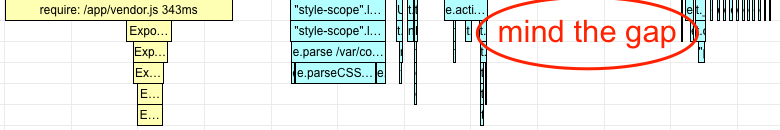
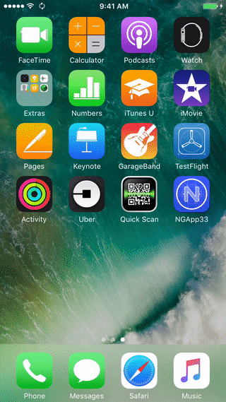
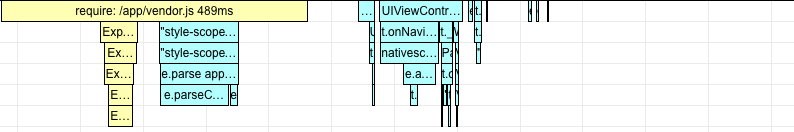
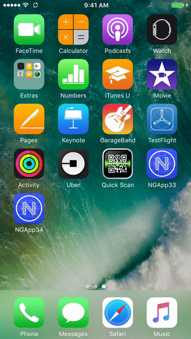

# NativeScript 3.4.0: Angular iOS Startup
We've been working hard on getting the support for Angular 5 ready, and it blended nicely with the CLI hooks feature letting it consume outside bundlers. Yay, now you can:
```
tns run ios --bundle --env.uglify --provision NativeScriptDevProfile
```

## Perf 3.3
Now with me focused on the performance as always came the question did something in the startup change? So I run the timeline-view on top of a 3.3.0 hello world app with Angular 4 to see that:



[times-ios-ng-v33.html](./reports/times-ios-ng-v33.html)

See the gap after the `activateWith`? It happens that angular will make a promise on bootstrap, create a Page synchronously, chain a promise that will create the Page UI, the promise is resolved but the callbacks chained happen on the next tick on the main loop, so iOS layouts the main Window capturing a white page.

What happens next is the promise ticks, creates UI but iOS wouldn't fire a next layout, delaying the ListView and its cell generation until the launch-screen to home component animation is played. After the ListView is layed out it needs roughly 150ms to create its cells.

Here is how it looks, see the white page blinking between the {N} logo and the main-page:



## Perf 3.4
With the nativescript-angular v3.4 we will drain the microtasks in the nativescript-zone in the UIViewController's viewWillAppear, having angular create the whole UI synchronously. iOS will happily render it all before the launch-screen to home component animation is played leading to the following times:



[times-ios-ng-v34.html](./reports/times-ios-ng-v34.html)

You have probably noted the big chunk of CSS parsing actually moved into the vendor, it will be captured in the android snapshot now. For iOS you can [contribute to the extra fast JavaScript CSS spec complying parser here](https://github.com/nativeScript/css-parser), it aims to be two times faster than rework in Android and about four times faster on JSC in iOS, but we will measure it precisely when it is done.

Still, the startup is good enough, we can now follow the design guidelines of [Human Interface Guidelines - Launch Screen](https://developer.apple.com/ios/human-interface-guidelines/icons-and-images/launch-screen/). That's to screen capture the home component, delete the texts out of it and and use the result as launch screen. This will be an image that has just the navigation bar with the app title. But the transition from it to the home component will fade nicely this time.


Now go make your apps awesome,
I can't wait to give you the {N} v3.4!

